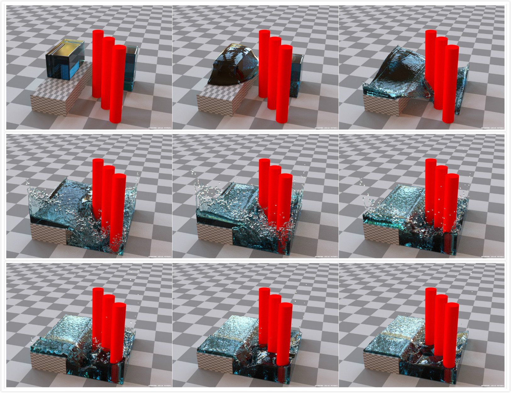
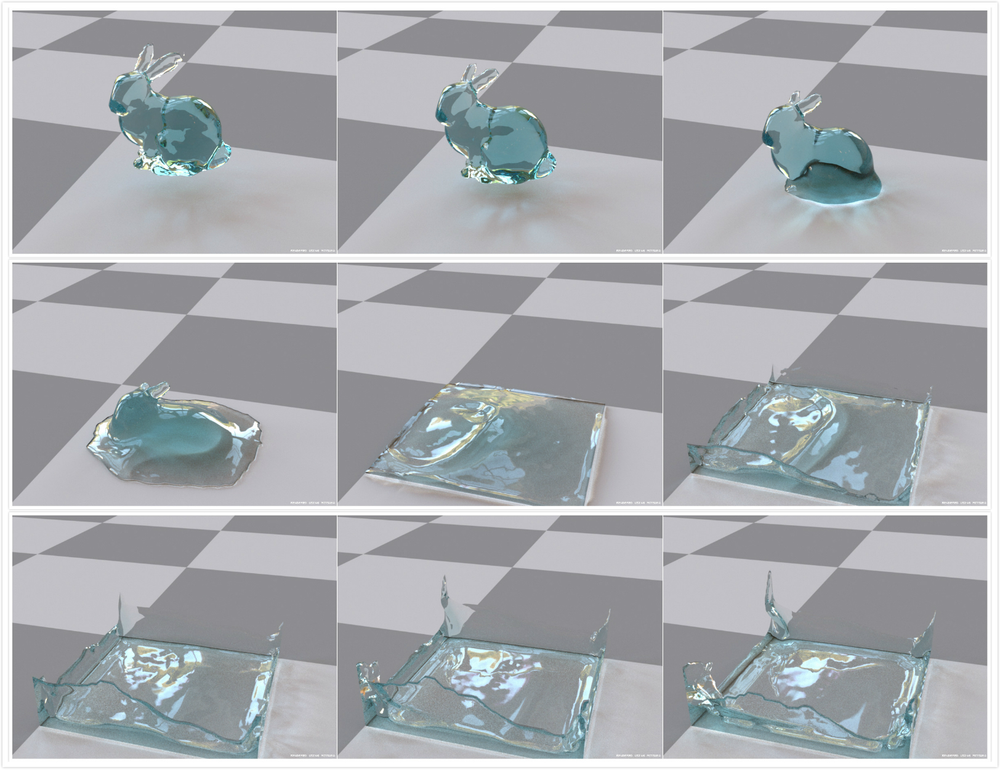

# FluidEngine

This is a fluid simulation engine for computer graphics applications. I adopt it from Doyub Kim's [fluid-engine-dev](https://github.com/doyubkim/fluid-engine-dev). It's built on C++11 and compiled with Microsoft Visual Studio 2017. This fluid engine is just for personal learning and interest. 

## Features

- Basic math and geometry operations and data structures
- Jacobi, Gauss-Seidel, SOR, MG, CG, ICCG, and MGPCG linear system solvers
- Spherical, SPH, Zhu & Bridson, and Anisotropic kernel for points-to-surface converter
- Intel TBB multi-threading backends
- SPH and PCISPH fluid simulators
- Converters between signed distance function and triangular mesh
- Stable fluids-based smoke simulator (Pure Euler fluid solver)
- Level set-based liquid simulator
- Fluid solvers have both 2-D and 3-D version

## Start

Just clone the code and open it with Microsoft Visual Studio 2017.  There are three vs2017 projects. **FluidEngine** is the core of engine.  **Test** is for unit test while **FluidExample** includes several fluid demos.

## Todo

- PIC, FLIP, and APIC fluid simulators
- Position based fluid simulator
- Visualizer based on OpenGL
- Flame simulator
- GPU version of SPH Simulator
- ......

## Learning Notes(In Chinese)

These are not documentations for the engine but simulation algorithm notes.

- [流体模拟Fluid Simulation：流体模拟基础](https://yangwc.com/2019/05/01/fluidSimulation/)
- [流体模拟Fluid Simulation：Level Set & Marching Cube](https://yangwc.com/2019/07/30/LevelSet/)
- [流体模拟Fluid Simulation：求解流体不可压缩的泊松方程](https://yangwc.com/2019/08/03/MakingFluidImcompressible/)
- [流体模拟Fluid Simulation：基于SPH的拉格朗日流体模拟](https://yangwc.com/2019/08/29/SPH/)
- [流体模拟Fluid Simulation：基于欧拉网格的流体模拟](https://yangwc.com/2019/09/12/Smoke/)

- [流体模拟Fluid Simulation：Free-Surface Flow](https://yangwc.com/2019/09/22/FreeSurfaceFlow/)

## Example

The engine is just for simulation and can use some renderers (such as  [Mitsuba renderer](https://www.mitsuba-renderer.org/)) to render it for visualization.

#### PCISPH Simulation Example

#### Euler Simulation Solver Example

#### Level-set Based Liquid Example

## Reference

[1]    Müller M, Charypar D, Gross M. Particle-based fluid simulation for interactive applications[C]//Proceedings of the 2003 ACM SIGGRAPH/Eurographics symposium on Computer animation. Eurographics Association, 2003: 154-159.

[2]​    Becker M, Teschner M. Weakly compressible SPH for free surface flows[C]//Proceedings of the 2007 ACM SIGGRAPH/Eurographics symposium on Computer animation. Eurographics Association, 2007: 209-217.

[3]​    Schechter H, Bridson R. Ghost SPH for animating water[J]. ACM Transactions on Graphics (TOG), 2012, 31(4): 61.

[4]​    Kim, D. (2017). *Fluid engine development*. Boca Raton: Taylor & Francis, a CRC Press, Taylor & Francis Group.

[5]​    Adams and Wicke, Meshless approximation methods and applications in physics based modeling and animation, Eurographics tutorials 2009.

[6]​    Dan Koschier, Jan Bender. Smoothed Particle Hydrodynamics Techniques for the Physics Based Simulation of Fluids and Solids, Eurographics Tutorial 2019.

[7]​    Solenthaler B, Pajarola R. Predictive-corrective incompressible SPH[C]// Acm Siggraph. 2009.

[8]​    R. Bridson and M. Müller-Fischer. Fluid simulation: Siggraph 2007 course notes. In ACM SIGGRAPH 2007 Courses, pages 1–81, ACM, 2007.

[10]  Stam J. Stable fluids[J]. Acm Transactions on Graphics, 1999, 1999:121—128.

[11]  A. J. Chorin and J. E. Marsden. A Mathematical Introduction to Fluid Mechanics. Springer-Verlag. Texts in Applied Mathematics 4. Second Edition., New York, 1990.

[12]  Fedkiw R, Stam J, Jensen H W. Visual simulation of smoke[C]// Conference on Computer Graphics & Interactive Techniques. 2001.

## Acknowledgement

Thanks very much for Doyub Kim's book, ["Fluid Engine Development"](https://www.crcpress.com/Fluid-Engine-Development/Kim/p/book/9781498719926). I highly recommend this book if you are interested in fluid simulation.

